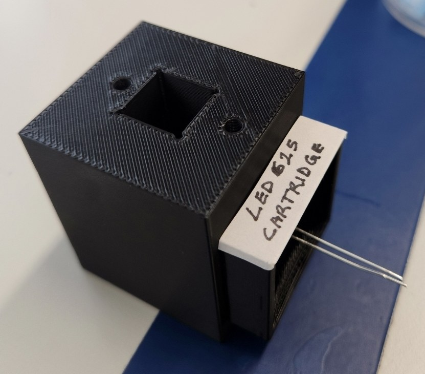
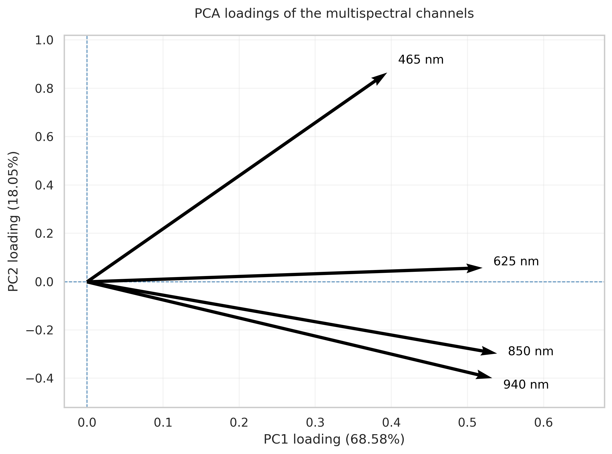
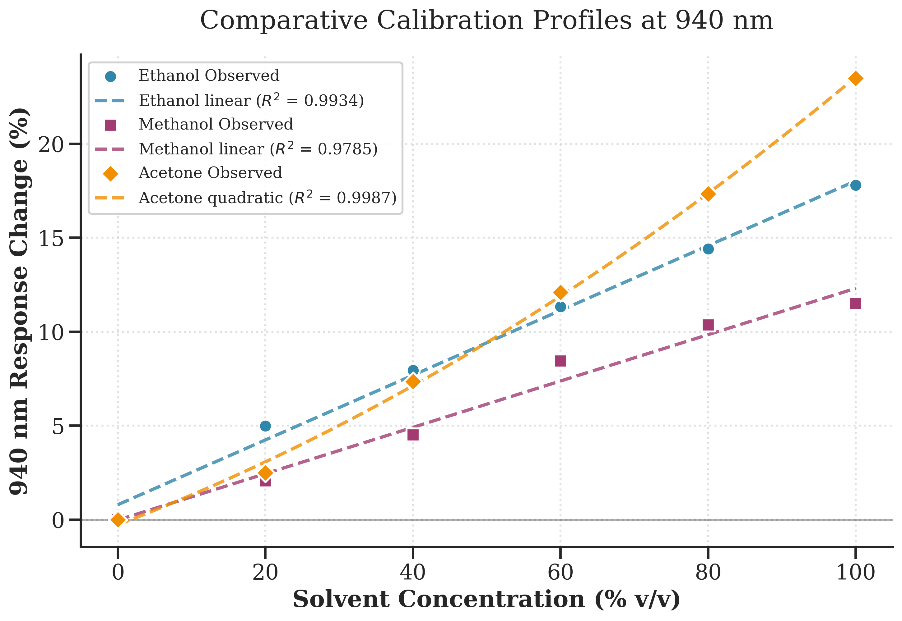
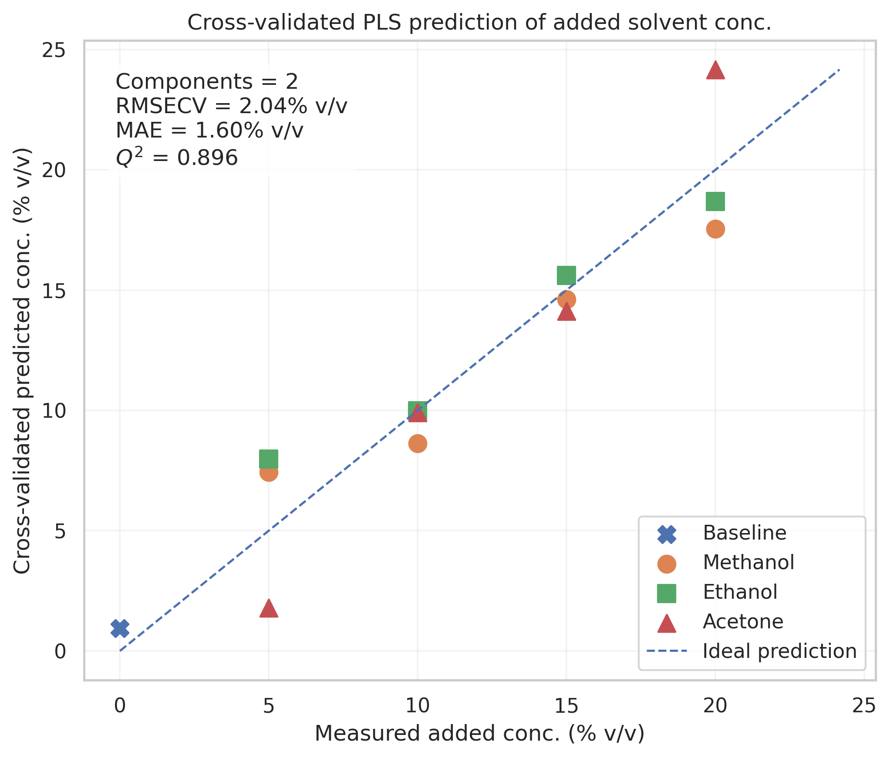
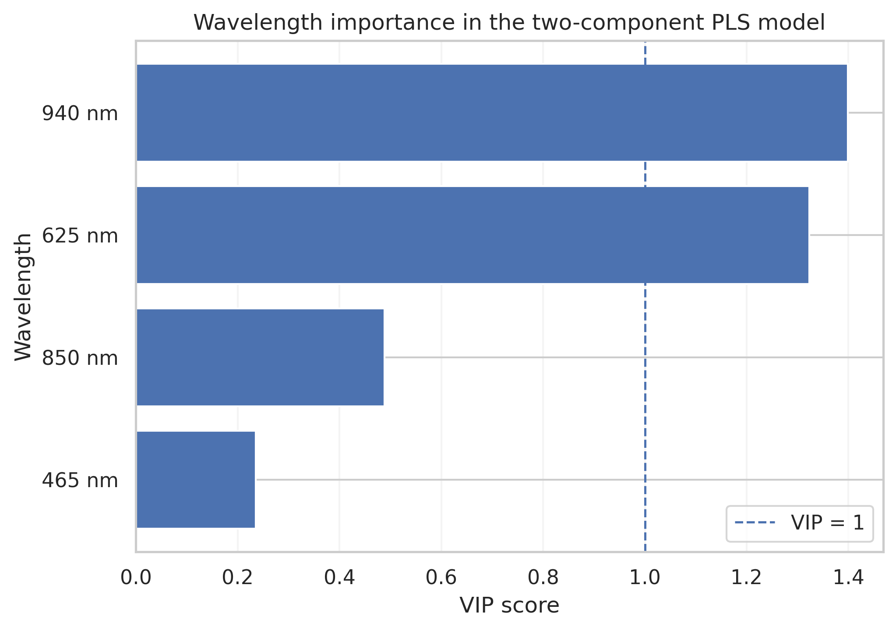
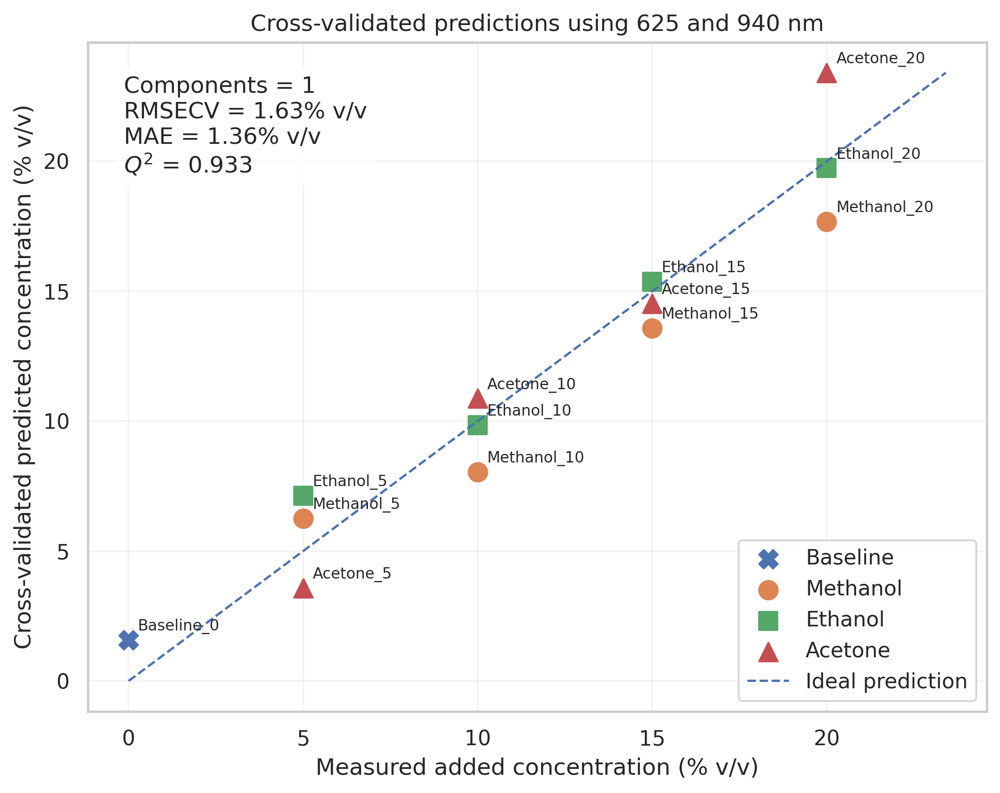
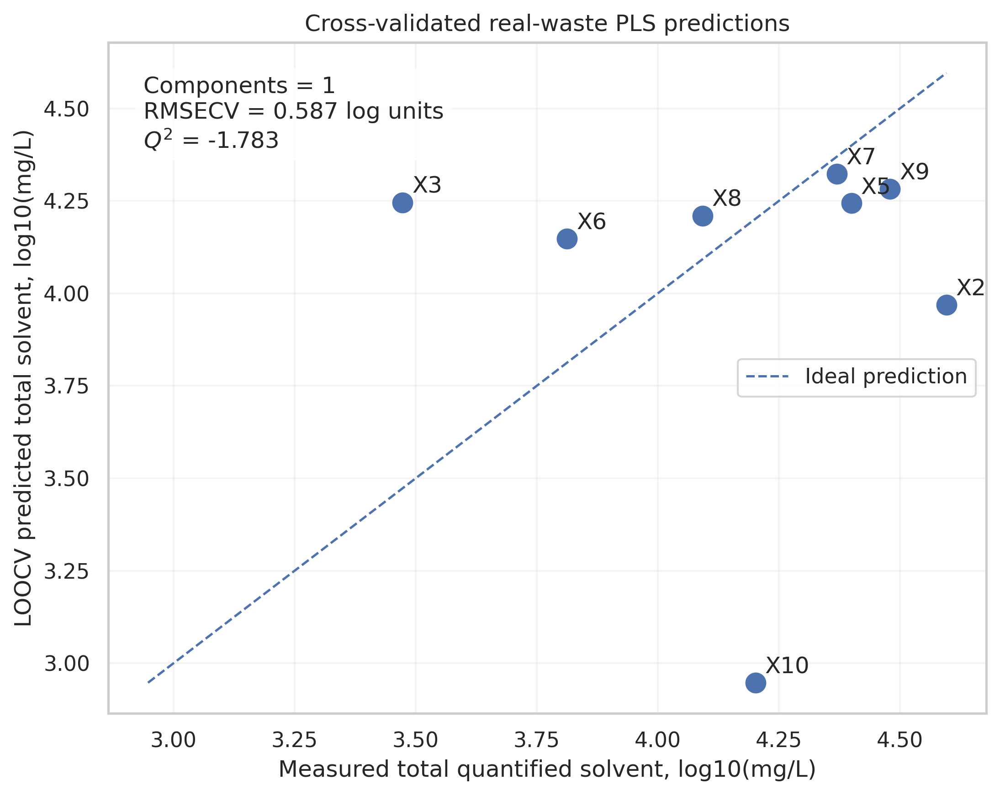

# Low-Cost Multispectral Sensing for Solvent-Waste Monitoring

Can a cheap LED-and-photodiode sensor screen organic solvent contamination in teaching-laboratory aqueous waste? This repository contains the data analysis for my MSc Analytical Chemistry research project (Kingston University London, 2026). It covers calibration, precision, PCA and cross-validated PLS modelling, plus benchmarking against GC.



## Key findings

- **Single-wavelength calibration works for ethanol at 940 nm.** The response was monotonic across 0–100% v/v, with a sensitivity of 31.63 counts per % v/v, R² = 0.993 and leave-one-level-out Q² = 0.979.
- **Multivariate PLS predicts solvent spiked into real waste.** A two-component PLS model on all four wavelengths gave Q² = 0.90 (RMSECV 2.04% v/v).
- **VIP scores identified a simpler model.** 940 nm (VIP 1.40) and 625 nm (1.32) carried most of the information, while 850 nm (0.49) and 465 nm (0.24) contributed little. A one-component model using only 625 + 940 nm *improved* performance to Q² = 0.93 (RMSECV 1.63% v/v).
- **Prediction across different real waste samples failed (negative Q²).** The spike models held the waste matrix constant. Across real samples, variation in the matrix (colour, turbidity, other dissolved species) dominated the optical response, so those samples fell outside the calibration domain.

## The sensor

| Component | Details |
|---|---|
| Microcontroller | Raspberry Pi Pico WH |
| Detector | TSL2591 light sensor |
| Light sources | LEDs at 465, 625, 850 and 940 nm |
| Sample | Sample holder | Light-tight 3D-printed housing with a square cuvette slot and interchangeable LED cartridges (one per wavelength) |
| Output | Detector counts per wavelength, saved as CSV |

## Analysis workflow

All analysis is in [`Project_78_Final_Data_Analysis.ipynb`](Project_78_Final_Data_Analysis.ipynb), which works through four stages:

| Stage | What it does |
|---|---|
| 1. Precision and calibration | Replicate precision (mean, SD, RSD); linear vs quadratic calibration per wavelength; leave-one-level-out cross-validation (RMSECV, Q²) |
| 2. PCA of pure solvents | PCA of ethanol, methanol and acetone standards to see which wavelengths drive the variation |
| 3. Spike PLS and VIP | Solvent spikes into a real waste matrix; cross-validated PLS; VIP-based wavelength selection; reduced-wavelength model |
| 4. Real waste vs GC | Optical response of real waste samples compared with GC reference values; exploratory PCA; PLS across samples |



## Results

### Calibration at 940 nm (ethanol, methanol, acetone)


### PLS model comparison (spiked waste)

| Model | Components | RMSECV (% v/v) | Q² |
|---|---|---|---|
| All wavelengths (465, 625, 850, 940 nm) | 2 | 2.04 | 0.90 |
| Reduced (625 + 940 nm) | 1 | 1.63 | 0.93 |



VIP scores showed that 940 nm and 625 nm carried most of the predictive information:



Rebuilding the model on just those two wavelengths improved prediction:



### Real waste samples vs GC

Across different real waste samples, cross-validated PLS predictions did not track GC concentrations (Q² = −1.78), because matrix variation between samples outweighed the solvent signal.



## Limitations

- **Matrix effects:** Calibration was not transferable across waste samples with different matrices (see Key findings).
- **Replication:** Ethanol precision reflects fill-to-fill repeatability, not independent reproducibility of standard preparation. For methanol and acetone only the per-run mean was saved, so within-run precision could not be reconstructed.
- **Sample size:** Only 10 real waste samples were available (8 used in the cross-sample PLS after excluding outliers X1 and X4), too few to model realistic matrix variability.

## Future work

- Check whether new samples lie inside the calibration domain using Hotelling's T² and Q-residual diagnostics.
- Calibrate with matrix-matched standards or standard addition.
- Add wavelengths or a scatter/turbidity reference channel.
- Collect more real waste samples across the range of lab activities.

## Reproducing the analysis

The notebook was developed in Google Colab. Raw sensor data and GC reference values are not currently included in this repository; contact me for access.

```bash
pip install pandas numpy scipy scikit-learn matplotlib
```

**Built with:** Python, pandas, NumPy, SciPy, scikit-learn, Matplotlib

## About

MSc Analytical Chemistry research project, Kingston University London. Supervisor: Dr. Gemma Shearman.

**Paul Kenneth** · [LinkedIn](https://www.linkedin.com/in/paulobi) · Paulkennethuk@gmail.com
